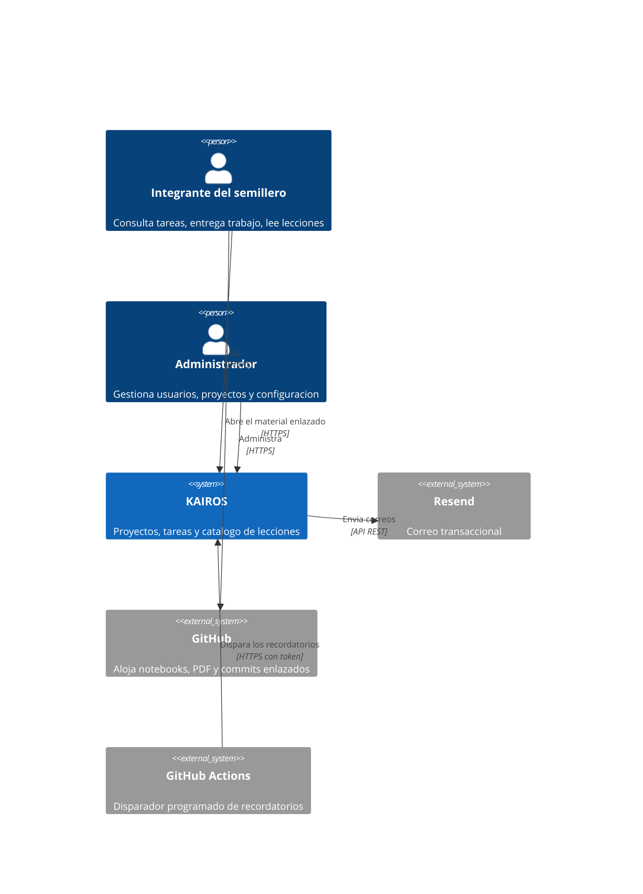
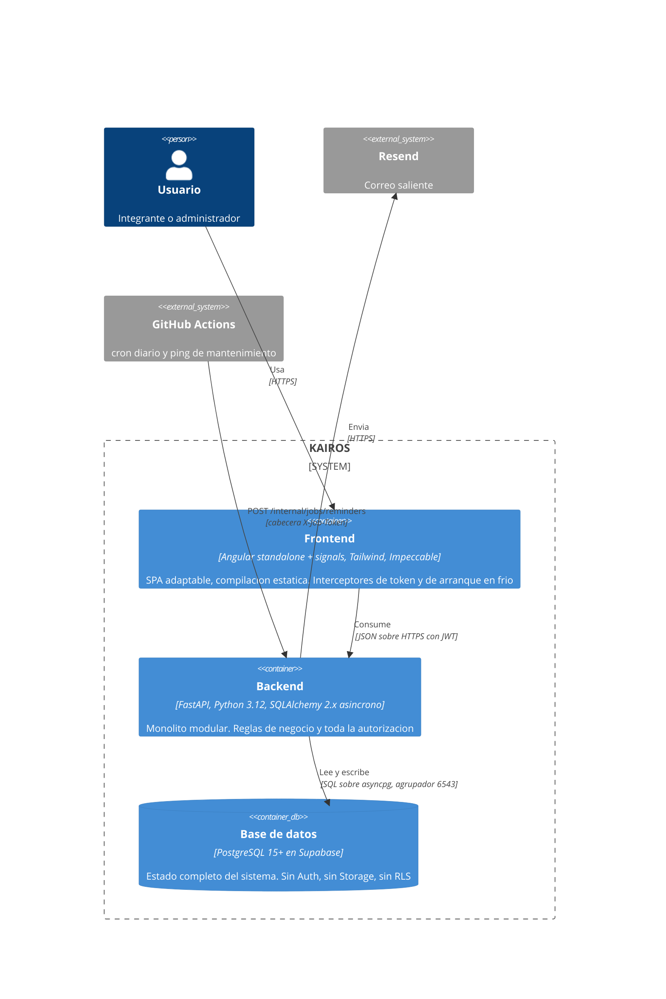
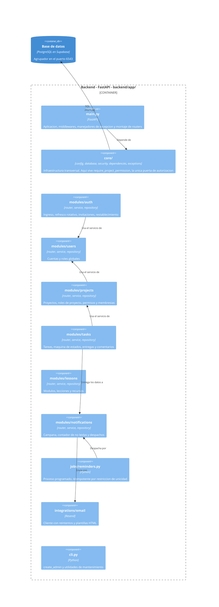

# KAIROS

Plataforma interna de gestión del **Semillero de Machine Learning**: proyectos con tablero Kanban, tareas con responsables y recordatorios automáticos por correo, y un catálogo de lecciones que enlaza el material alojado en GitHub.

Unos 50 usuarios, 10 proyectos activos y ~1.000 tareas por semestre. **Debe operar íntegramente en planes gratuitos.**

> **No es un clon de Jira.** Ante la duda entre una solución simple y una general, se elige la simple.

**Estado:** **Fases 0, 1 y 2 terminadas** ([plan](docs/roadmap.md)). Existe el acceso completo
—invitaciones, cuentas, roles globales, ingreso con refresco rotativo y recuperación de
contraseña— y sobre él, el sistema de autorización: proyectos con sus tres roles
predeterminados, roles a la medida con selección libre del catálogo de 14 permisos,
gestión de miembros y archivado de solo lectura. Los permisos se resuelven en cada
petición y nunca viajan dentro del token, así que un cambio de rol surte efecto de
inmediato (RN-22).

**Desplegado y funcionando** en `https://app.kairospartners.uk` (Cloudflare Workers) contra
`https://api.kairospartners.uk` (Render), con la base de datos de Supabase migrada y el
primer administrador creado. El dominio de envío está verificado en Resend, con SPF, DKIM
y DMARC publicados.

Lo siguiente es la **Fase 3** (tareas): el tablero Kanban y la máquina de estados. Las
fases 3 y 6 se pueden repartir en paralelo.

---

## Tabla de contenido

- [Qué resuelve](#qué-resuelve)
- [Arquitectura](#arquitectura)
  - [C4 nivel 1 — Contexto](#c4-nivel-1--contexto)
  - [C4 nivel 2 — Contenedores](#c4-nivel-2--contenedores)
  - [C4 nivel 3 — Componentes y estructura del proyecto](#c4-nivel-3--componentes-y-estructura-del-proyecto)
  - [C4 nivel 4 — Estructura del repositorio](#c4-nivel-4--estructura-del-repositorio)
- [Stack](#stack)
- [Puesta en marcha](#puesta-en-marcha)
- [Variables de entorno](#variables-de-entorno)
- [Reglas que no se negocian](#reglas-que-no-se-negocian)
- [Pruebas](#pruebas)
- [Documentación](#documentación)

---

## Qué resuelve

El semillero coordina hoy sus proyectos y su material por chats, carpetas sueltas y repositorios dispersos. De ahí salen tres problemas concretos:

| Problema | Cómo lo ataca la plataforma |
|---|---|
| Nadie sabe con certeza qué tareas tiene asignadas | Tablero Kanban por proyecto y vista personal «Mis tareas» que cruza todos los proyectos |
| Los vencimientos se pasan sin aviso | Recordatorios automáticos por correo y dentro de la aplicación, disparados por un proceso programado idempotente |
| El material de estudio está regado | Catálogo de módulos, lecciones y recursos que enlaza lo que ya vive en GitHub |

Todo lo que no sirva directamente a esos tres problemas está [fuera de alcance](docs/PRD.md).

---

## Arquitectura

Monolito modular en el backend, aplicación de página única en el frontend, base de datos gestionada y un proceso programado externo. El detalle completo está en [`docs/architecture.md`](docs/architecture.md).

### C4 nivel 1 — Contexto



La plataforma **no aloja archivos**: el material vive en GitHub y el usuario lo abre directamente.

### C4 nivel 2 — Contenedores



El frontend **nunca** habla con la base de datos: toda regla y toda autorización viven en el backend.

### C4 nivel 3 — Componentes y estructura del proyecto

Este nivel es el que define cómo está organizado el código. Cada módulo de `modules/` tiene siempre las mismas piezas y las fronteras entre ellas se respetan como si fueran servicios distintos.



**Fronteras entre capas** — se respetan estrictamente:

- `router.py` — HTTP puro. Sin consultas, sin reglas de negocio.
- `service.py` — reglas de negocio. Sin objetos HTTP, sin SQL crudo. Levanta excepciones de dominio.
- `repository.py` — consultas. Sin condiciones de negocio.
- Un módulo **no importa** el repositorio ni los modelos de otro: usa el servicio del otro módulo.
- **No hay `relationship()` de SQLAlchemy que cruce módulos.** Solo llaves foráneas por identificador.
- Las transacciones se abren y se confirman en el servicio.

Dependencias permitidas: `auth → users`, `projects → users`, `tasks → projects, notifications`, `lessons → ninguno`, `notifications → ninguno` (recibe los datos, no los busca).

### C4 nivel 4 — Estructura del repositorio

```
KAIROS/
├── CLAUDE.md                        Convenciones obligatorias para quien escriba código
├── README.md
├── docs/                            Requisitos, reglas, modelo de datos, arquitectura, API
├── .github/workflows/
│   ├── reminders.yml                cron diario 12:00 UTC = 07:00 America/Bogota
│   └── keepalive.yml                ping cada 10 min en horario hábil
├── backend/
│   ├── app/
│   │   ├── main.py
│   │   ├── core/                    config · database · security · dependencies · exceptions
│   │   ├── modules/
│   │   │   ├── auth/                router · service · repository · models · schemas · exceptions
│   │   │   ├── users/
│   │   │   ├── projects/            incluye roles, permisos y membresías
│   │   │   ├── tasks/               incluye entregas y comentarios
│   │   │   ├── lessons/
│   │   │   └── notifications/
│   │   ├── jobs/reminders.py
│   │   ├── integrations/email/      client.py y templates/
│   │   └── cli.py
│   ├── alembic/
│   ├── tests/                       unit/ e integration/
│   ├── pyproject.toml
│   └── .env.example
└── frontend/
    ├── src/app/
    │   ├── core/                    auth/ · api/ · layout/
    │   ├── features/                auth · dashboard · projects · lessons · admin
    │   └── shared/                  ui/ · pipes/
    ├── PRODUCT.md                   generado por Impeccable
    ├── DESIGN.md                    tokens de diseño (no se inventan a mano)
    └── package.json
```

---

## Stack

| Capa | Decisión |
|---|---|
| Frontend | Angular (componentes standalone, signals, sin NgModules ni NgRx), Tailwind CSS, [Impeccable](https://github.com/pbakaus/impeccable) como capa de diseño |
| Backend | FastAPI · Python 3.12 · SQLAlchemy 2.x asíncrono · Alembic · Pydantic v2 · asyncpg · Argon2 |
| Base de datos | PostgreSQL en Supabase, **solo como base de datos gestionada**: sin Supabase Auth, Storage ni RLS |
| Autenticación | Propia, con JWT emitidos por FastAPI. Los permisos **no** viajan en el token |
| Correo | Resend, remitente en `send.kairospartners.uk` |
| Proceso programado | GitHub Actions con cron, contra un endpoint interno protegido |
| Despliegue | Cloudflare Pages (`app.`) · Render plan gratuito (`api.`) · Supabase |

---

## Puesta en marcha

### Backend

```bash
cd backend
uv sync                                  # o: pip install -e ".[dev]"
uv run alembic upgrade head
uv run uvicorn app.main:app --reload
uv run pytest
uv run ruff check --fix .
uv run python -m app.cli create_admin    # primer administrador
```

### Frontend

```bash
cd frontend
npm install
npm start
npm run build
npm test
npx impeccable detect src/               # analizador de diseño
```

El sistema visual está documentado en [`frontend/DESIGN.md`](frontend/DESIGN.md) y el contexto
de producto en [`PRODUCT.md`](PRODUCT.md), ambos generados por Impeccable a partir de lo
construido. Antes de una pantalla nueva: `/impeccable shape`; al terminarla, `/impeccable audit`
y `/impeccable polish`.

El backend en desarrollo apunta al Postgres local (`backend/.env`). Para correrlo contra
Supabase existe `backend/.env.supabase`, ignorado por git:

```bash
.venv/Scripts/dotenv -f .env.supabase run -- alembic upgrade head
```

---

## Variables de entorno

Ningún secreto vive en el código. Todo va por variables de entorno, con su entrada en `.env.example`.

```
DATABASE_URL=postgresql+asyncpg://...    # agrupador en el puerto 6543, no el 5432
JWT_SECRET=...
JWT_ACCESS_TTL_MINUTES=15
JWT_REFRESH_TTL_DAYS=7
RESEND_API_KEY=...
EMAIL_FROM=Semillero ML <notificaciones@send.kairospartners.uk>
FRONTEND_URL=https://app.kairospartners.uk
JOB_TOKEN=...
CORS_ORIGINS=https://app.kairospartners.uk
ENVIRONMENT=production
```

---

## Reglas que no se negocian

1. **No inventes requisitos.** Si algo no está en la documentación, pregunta antes de implementarlo.
2. **Nada de la sección «Fuera de alcance»** del PRD: ni tareas recurrentes automáticas, ni carga de archivos, ni bitácora de auditoría, ni progreso de lecciones.
3. **Toda autorización se verifica en el backend.** Ocultar un botón en el frontend es experiencia de usuario, no seguridad.
4. **Los permisos no van dentro del JWT.** Se consultan por petición (RN-22).
5. **La idempotencia del proceso de recordatorios se apoya en la restricción de unicidad de la base de datos**, no en una comprobación en Python: insertar en `notification_dispatches` con `ON CONFLICT DO NOTHING` **antes** de enviar.
6. **Nada de datos derivados en la base.** Sin columnas de conteo, sin `is_overdue` almacenado.
7. **Ningún secreto en el código.**
8. **No uses Supabase Auth, Storage ni RLS.**
9. **Un fallo de correo nunca revierte una operación de negocio.** Se registra y se sigue.
10. **Los mensajes de error visibles van en español.** Códigos, variables, tablas, endpoints y comentarios, en inglés.

Errores frecuentes que cuestan caro: devolver **403 en lugar de 404** en un proyecto ajeno (filtra su existencia), usar `datetime.now()` sin zona horaria, dejar que un revisor apruebe su propia entrega (RN-07), y conectarse a Supabase por el puerto 5432 en vez del agrupador 6543 con `statement_cache_size=0`.

---

## Pruebas

Cobertura obligatoria, sin excepciones:

1. **Transiciones de estado de tareas** — cada transición válida e inválida de [`business-rules.md`](docs/business-rules.md).
2. **Resolución de permisos** — `require_project_permission` con rol de sistema, rol a la medida, no miembro y proyecto archivado.
3. **Idempotencia del proceso programado** — ejecutarlo dos veces no debe generar envíos duplicados.

Las pruebas de integración se derivan de los escenarios Gherkin de [`docs/user-stories.md`](docs/user-stories.md) y **usan los mismos nombres**, para poder rastrearlas.

---

## Documentación

| Documento | Contiene |
|---|---|
| [`docs/especificacion-tecnica.pdf`](docs/especificacion-tecnica.pdf) | **Documento consolidado**: requisitos, reglas, arquitectura, modelo de datos, API, plan y trazabilidad |
| [`docs/PRD.md`](docs/PRD.md) | Requisitos numerados (RF-xx, RNF-xx), escenarios, alcance |
| [`docs/business-rules.md`](docs/business-rules.md) | **Fuente de verdad** de permisos, transiciones y reglas (RN-xx) |
| [`docs/data-model.md`](docs/data-model.md) | Tablas, restricciones, índices |
| [`docs/architecture.md`](docs/architecture.md) | Módulos, autorización, proceso programado, despliegue |
| [`docs/api-contract.md`](docs/api-contract.md) | Endpoints, esquemas, códigos de error |
| [`docs/user-stories.md`](docs/user-stories.md) | Criterios de aceptación en Gherkin |
| [`docs/roadmap.md`](docs/roadmap.md) | Orden de implementación en ocho fases |

Ante contradicción entre documentos, manda `business-rules.md`.

El PDF se regenera desde su fuente HTML con Edge o Chrome en modo headless:

```bash
msedge --headless=new --no-pdf-header-footer \
  --print-to-pdf=docs/especificacion-tecnica.pdf docs/especificacion-tecnica.html
```

---

## Convención de commits

Cada mensaje referencia el requisito que implementa:

```
feat(tasks): revisión de entregas (RF-33, RN-07)
```
