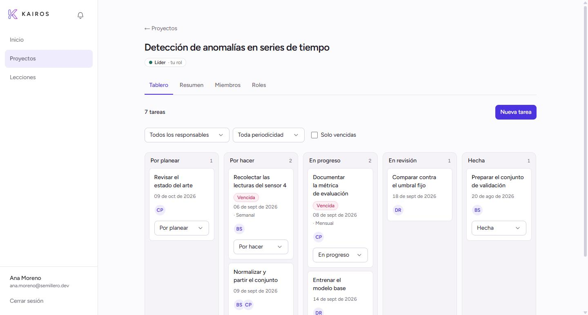
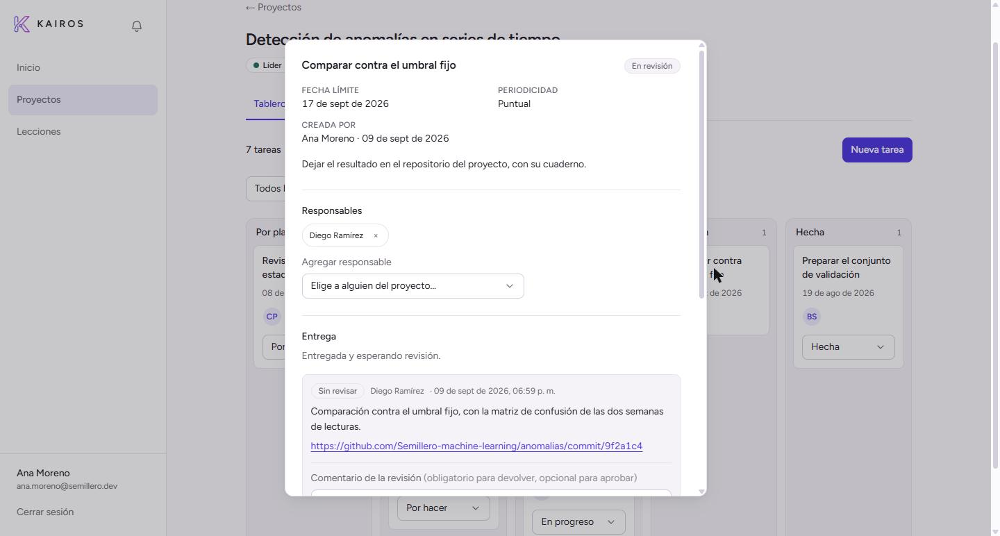
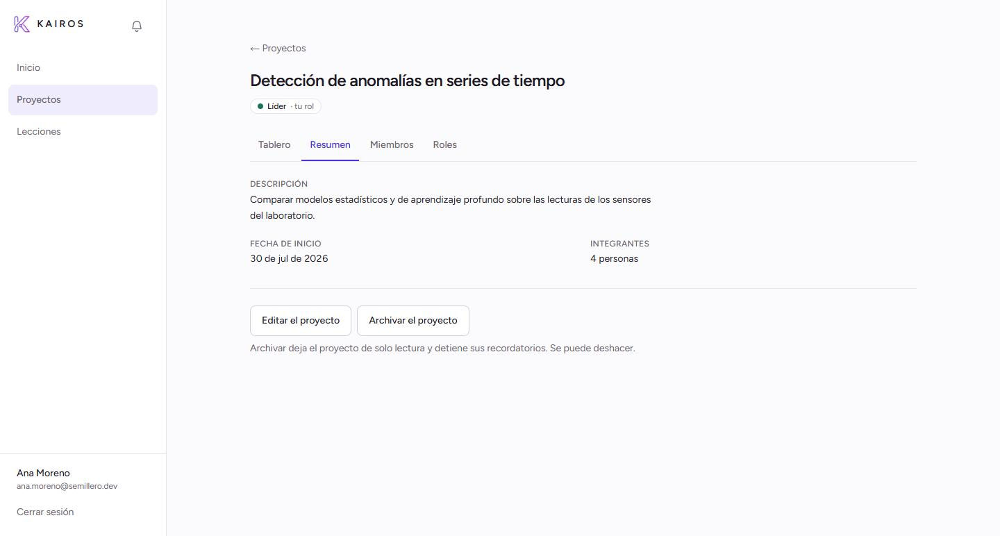
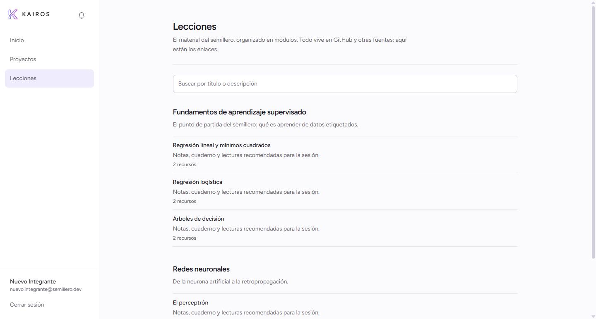
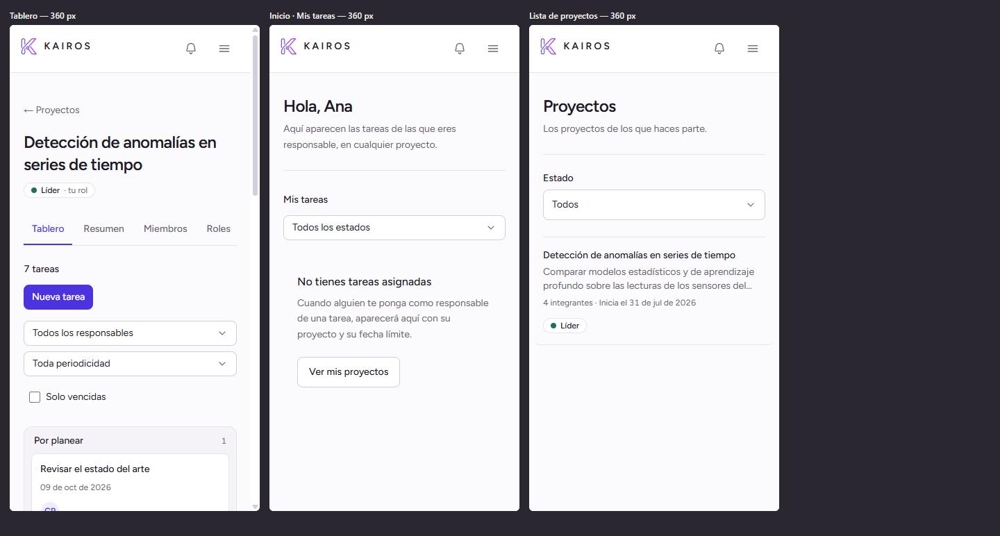
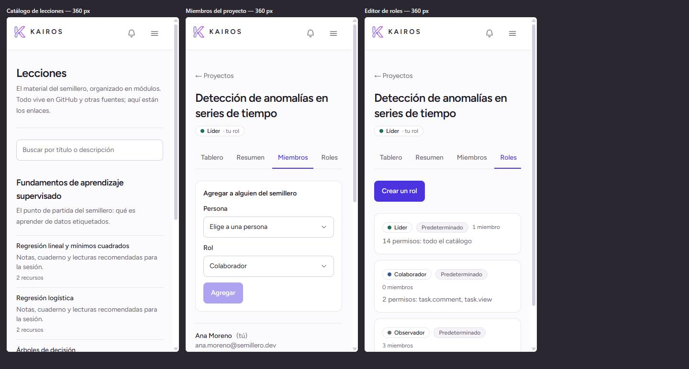
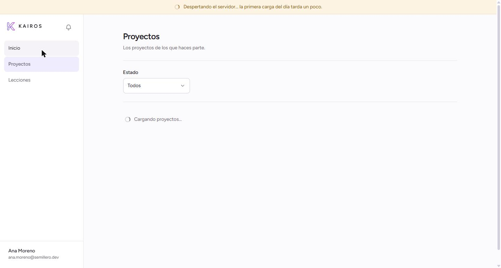
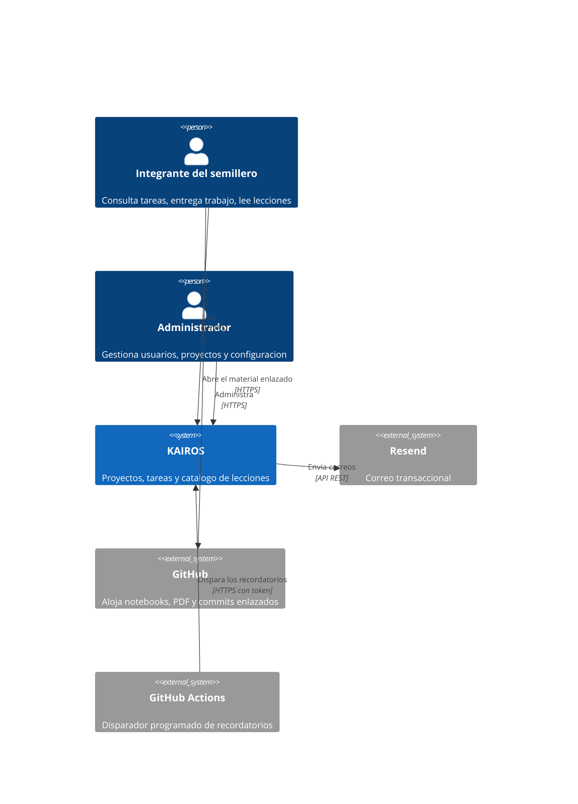
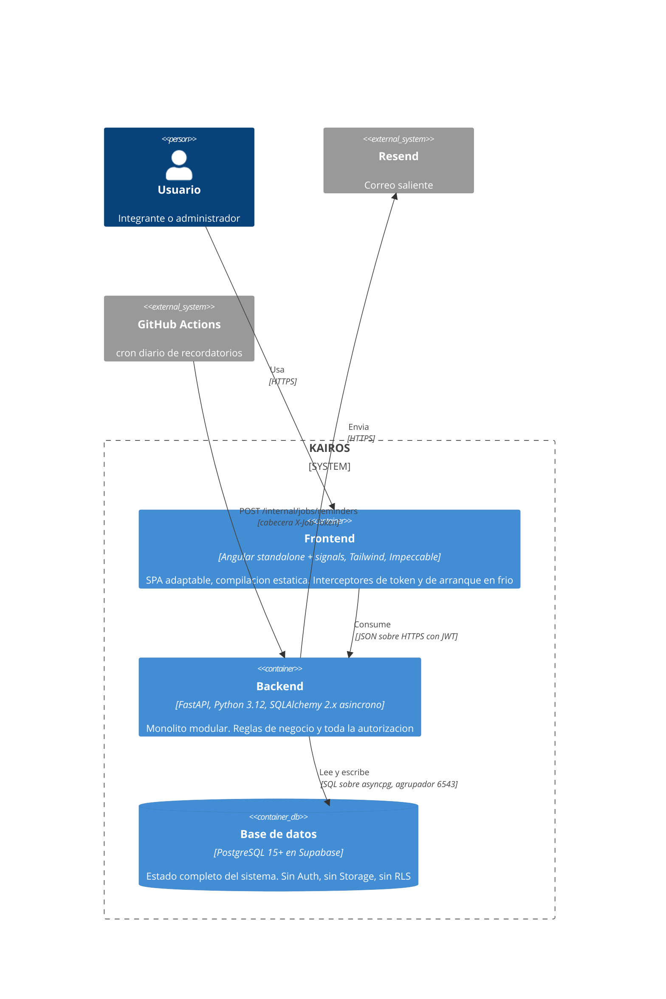
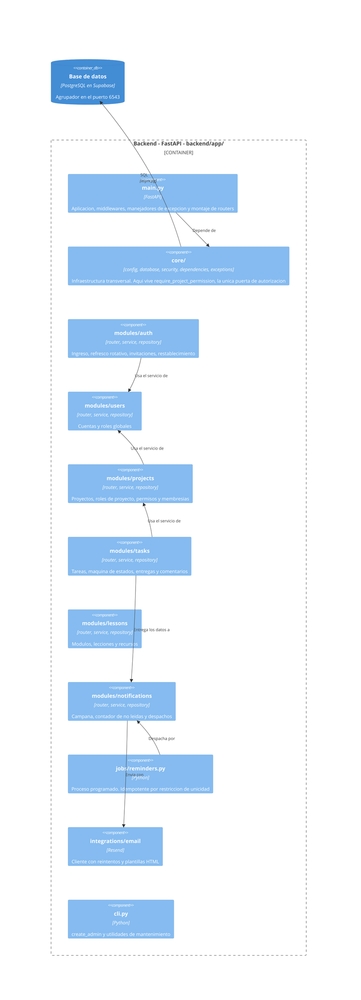

<div align="center">


### La plataforma del Semillero de Machine Learning

**Proyectos con tablero Kanban. Tareas con responsables, entregas y revisión.
Recordatorios que llegan solos. El material de estudio, por fin en un solo sitio.**

[](https://app.kairospartners.uk)
[](docs/especificacion-tecnica.pdf)


**[▶ Abrir la aplicación](https://app.kairospartners.uk)** &nbsp;·&nbsp; el registro es cerrado: se entra con invitación

</div>

<br>



<br>

---

## El problema

El semillero coordinaba sus proyectos por chats, carpetas sueltas y repositorios dispersos.
De ahí salían tres problemas concretos, y la plataforma existe para atacar esos tres. Nada más.

| El problema | La respuesta |
|---|---|
| **Nadie sabe con certeza qué tiene asignado** | Tablero Kanban por proyecto y una vista personal «Mis tareas» que cruza todos los proyectos de un vistazo |
| **Los vencimientos se pasan sin aviso** | Recordatorios automáticos por correo y dentro de la aplicación, disparados por un proceso programado idempotente |
| **El material de estudio está regado** | Catálogo de módulos, lecciones y recursos que enlaza lo que ya vive en GitHub |

> **No es un clon de Jira.** Ante la duda entre una solución simple y una general, se elige la
> simple. Todo lo que no sirva directamente a esos tres problemas está
> [fuera de alcance](docs/PRD.md), por escrito y a propósito.

---

## En números

<table align="center">
<tr>
<td align="center"><h3>411</h3></td>
<td align="center"><h3>71</h3></td>
<td align="center"><h3>19</h3></td>
<td align="center"><h3>14</h3></td>
<td align="center"><h3>$0</h3></td>
</tr>
<tr>
<td align="center">pruebas<br>automatizadas</td>
<td align="center">endpoints</td>
<td align="center">tablas</td>
<td align="center">permisos</td>
<td align="center">de<br>infraestructura</td>
</tr>
</table>

Ocho fases, de los cimientos a la auditoría final, **todas terminadas y desplegadas**.
313 pruebas en el backend y 98 en el frontend, con las de integración derivadas una a una de
los escenarios Gherkin de [`docs/user-stories.md`](docs/user-stories.md) y **con sus mismos
nombres**, para poder rastrear cada criterio de aceptación hasta la prueba que lo verifica.

---

## Cómo se ve

### El trabajo del día

Una tarea no es una tarjeta con un título. Lleva responsables, fecha límite, periodicidad,
entrega con enlace al commit y una revisión que aprueba o devuelve — y que **nunca** puede
hacer quien entregó (RN-07).



### El proyecto



### El material

El semillero no aloja archivos: el material vive en GitHub y el catálogo lo enlaza, organizado
en módulos y lecciones con sus recursos.



### En el teléfono, de verdad

El piso son **360 px**. Por debajo de 768 px el tablero deja de ser Kanban y se vuelve lista por
estado con selector, porque arrastrar y soltar con el pulgar en una pantalla de teléfono no
funciona. Las áreas táctiles miden 44 × 44 px como mínimo.





### Cuando el servidor está dormido

El backend corre en el plan gratuito de Render y se suspende tras 15 minutos sin uso. La primera
petición del día puede tardar cerca de un minuto. La aplicación **nunca** muestra una pantalla en
blanco ni un error genérico: a los 3 segundos aparece una banda que dice exactamente lo que está
pasando, y espera hasta 90 segundos.



---

## Lo que lo sostiene por dentro

### Los permisos se resuelven en cada petición

Un catálogo cerrado de **14 permisos**. Tres roles predeterminados por proyecto — Líder,
Colaborador, Observador — y roles a la medida que eligen libremente del catálogo.

Los permisos **no viajan dentro del token**. Se consultan por petición (RN-22), así que quitarle
un rol a alguien surte efecto de inmediato y no en quince minutos, cuando le venza el JWT.

Toda la autorización pasa por una sola puerta, la dependencia `require_project_permission`.
No hay condicionales sueltos comprobando permisos dentro de un servicio.

Y un proyecto ajeno devuelve **404, no 403**: un 403 confirmaría que el proyecto existe.

### Los recordatorios no se duplican, por construcción

La idempotencia del proceso programado no descansa en una comprobación en Python — eso deja una
ventana de carrera abierta. Descansa en una restricción de unicidad de la base de datos: se
inserta en `notification_dispatches` con `ON CONFLICT DO NOTHING` **antes** de enviar. Correrlo
dos veces el mismo día no manda dos correos, y hay una prueba que lo verifica.

### Un fallo de correo no revierte una operación de negocio

Se registra y se sigue. Que Resend esté caído no puede impedir que alguien cree una tarea.

### El diseño no se improvisa

El sistema visual está documentado en [`frontend/DESIGN.md`](frontend/DESIGN.md), generado por
[Impeccable](https://github.com/pbakaus/impeccable) a partir de lo construido, y hay un analizador
que falla si aparece un anti-patrón: tipografías por defecto del sistema, degradados de morado a
azul, tarjetas dentro de tarjetas, grises puros o suavizados con rebote.

Todos los neutros van entintados hacia el violeta de la marca. La estructura se dibuja con bordes
de un pelo, no con sombras. Hay exactamente un acento, una alarma, un verde y un ámbar.

---

## Arquitectura

Monolito modular en el backend, aplicación de página única en el frontend, base de datos
gestionada y un proceso programado externo. El detalle completo está en
[`docs/architecture.md`](docs/architecture.md).

### C4 nivel 1 — Contexto



La plataforma **no aloja archivos**: el material vive en GitHub y el usuario lo abre directamente.

### C4 nivel 2 — Contenedores



El frontend **nunca** habla con la base de datos: toda regla y toda autorización viven en el backend.

### C4 nivel 3 — Componentes y estructura del proyecto

Este nivel es el que define cómo está organizado el código. Cada módulo de `modules/` tiene siempre
las mismas piezas y las fronteras entre ellas se respetan como si fueran servicios distintos.



**Fronteras entre capas** — se respetan estrictamente:

- `router.py` — HTTP puro. Sin consultas, sin reglas de negocio.
- `service.py` — reglas de negocio. Sin objetos HTTP, sin SQL crudo. Levanta excepciones de dominio.
- `repository.py` — consultas. Sin condiciones de negocio.
- Un módulo **no importa** el repositorio ni los modelos de otro: usa el servicio del otro módulo.
- **No hay `relationship()` de SQLAlchemy que cruce módulos.** Solo llaves foráneas por identificador.
- Las transacciones se abren y se confirman en el servicio.

Dependencias permitidas: `auth → users`, `projects → users`, `tasks → projects, notifications`,
`lessons → ninguno`, `notifications → ninguno` (recibe los datos, no los busca).

### C4 nivel 4 — Estructura del repositorio

```
KAIROS/
├── CLAUDE.md                        Convenciones obligatorias para quien escriba código
├── README.md
├── PRODUCT.md                       contexto de producto, generado por Impeccable
├── render.yaml                      Blueprint del servicio de Render
├── docs/
│   ├── PRD.md                       requisitos numerados (RF-xx, RNF-xx)
│   ├── business-rules.md            fuente de verdad de permisos y transiciones (RN-xx)
│   ├── data-model.md                tablas, restricciones, índices
│   ├── architecture.md              módulos, autorización, proceso programado
│   ├── api-contract.md              endpoints, esquemas, códigos de error
│   ├── user-stories.md              criterios de aceptación en Gherkin
│   ├── roadmap.md                   las ocho fases
│   ├── deployment-checklist.md      procedimiento de despliegue, paso a paso
│   └── especificacion-tecnica.pdf   documento consolidado
├── .github/
│   ├── assets/                      capturas de este README
│   └── workflows/
│       └── reminders.yml            cron diario 12:00 UTC = 07:00 America/Bogota
├── backend/
│   ├── app/
│   │   ├── main.py                  aplicación, middlewares, routers, manejadores de excepción
│   │   ├── core/                    config · database · security · dependencies · exceptions
│   │   ├── modules/
│   │   │   ├── auth/                router · service · repository · models · schemas · exceptions
│   │   │   ├── users/               cuentas y roles globales
│   │   │   ├── projects/            incluye roles, permisos y membresías
│   │   │   ├── tasks/               incluye entregas y comentarios
│   │   │   ├── lessons/             módulos, lecciones y recursos
│   │   │   └── notifications/       campana, contador y despachos
│   │   ├── jobs/reminders.py        proceso programado, idempotente
│   │   ├── integrations/email/      client.py y templates/
│   │   └── cli.py                   create_admin y mantenimiento
│   ├── alembic/versions/            9 migraciones
│   ├── tests/
│   │   ├── unit/                    seguridad, transiciones, validación
│   │   └── integration/             una por historia de usuario (HU-01 … HU-13)
│   ├── pyproject.toml
│   └── .env.example
└── frontend/
    ├── src/app/
    │   ├── core/                    auth/ · api/ · http/ · layout/ · notifications/
    │   ├── features/                auth · dashboard · projects · lessons · admin · profile
    │   └── shared/                  ui/ · pipes/
    ├── public/brand/                los rasters de la marca, con su procedencia
    ├── DESIGN.md                    tokens de diseño (no se inventan a mano)
    ├── wrangler.jsonc               Worker de Cloudflare que sirve el build
    └── package.json
```

---

## Stack

| Capa | Decisión |
|---|---|
| Frontend | Angular (componentes standalone, signals, sin NgModules ni NgRx), Tailwind CSS, [Impeccable](https://github.com/pbakaus/impeccable) como capa de diseño |
| Backend | FastAPI · Python 3.12 · SQLAlchemy 2.x asíncrono · Alembic · Pydantic v2 · asyncpg · Argon2id |
| Base de datos | PostgreSQL en Supabase, **solo como base de datos gestionada**: sin Supabase Auth, Storage ni RLS |
| Autenticación | Propia, con JWT emitidos por FastAPI. Acceso de 15 min, refresco rotativo de 7 días guardado solo como hash. Los permisos **no** viajan en el token |
| Correo | Resend, remitente verificado en `send.kairospartners.uk` con SPF, DKIM y DMARC |
| Proceso programado | GitHub Actions con cron, contra un endpoint interno protegido por token |
| Despliegue | Cloudflare Workers (`app.`) · Render plan gratuito (`api.`) · Supabase (base de datos) |

Todo dentro de planes gratuitos. **El único gasto autorizado es el dominio.**

---

## Puesta en marcha

### Backend

```bash
cd backend
uv sync                                  # o: pip install -e ".[dev]"
uv run alembic upgrade head
uv run uvicorn app.main:app --reload
uv run pytest
uv run ruff check --fix .
uv run python -m app.cli create_admin    # primer administrador
```

### Frontend

```bash
cd frontend
npm install
npm start
npm run build
npm test
npx impeccable detect src/               # analizador de diseño
```

El sistema visual está documentado en [`frontend/DESIGN.md`](frontend/DESIGN.md) y el contexto
de producto en [`PRODUCT.md`](PRODUCT.md), ambos generados por Impeccable a partir de lo
construido. Antes de una pantalla nueva: `/impeccable shape`; al terminarla, `/impeccable audit`
y `/impeccable polish`.

El backend en desarrollo apunta al Postgres local (`backend/.env`). Para correrlo contra
Supabase existe `backend/.env.supabase`, ignorado por git:

```bash
.venv/Scripts/dotenv -f .env.supabase run -- alembic upgrade head
```

---

## Variables de entorno

Ningún secreto vive en el código. Todo va por variables de entorno, con su entrada en `.env.example`.

```
DATABASE_URL=postgresql+asyncpg://...    # agrupador en el puerto 6543, no el 5432
JWT_SECRET=...
JWT_ACCESS_TTL_MINUTES=15
JWT_REFRESH_TTL_DAYS=7
RESEND_API_KEY=...
EMAIL_FROM=Semillero ML <notificaciones@send.kairospartners.uk>
FRONTEND_URL=https://app.kairospartners.uk
JOB_TOKEN=...
CORS_ORIGINS=https://app.kairospartners.uk
ENVIRONMENT=production
```

---

## Reglas que no se negocian

1. **No inventes requisitos.** Si algo no está en la documentación, pregunta antes de implementarlo.
2. **Nada de la sección «Fuera de alcance»** del PRD: ni tareas recurrentes automáticas, ni carga de archivos, ni bitácora de auditoría, ni progreso de lecciones.
3. **Toda autorización se verifica en el backend.** Ocultar un botón en el frontend es experiencia de usuario, no seguridad.
4. **Los permisos no van dentro del JWT.** Se consultan por petición (RN-22).
5. **La idempotencia del proceso de recordatorios se apoya en la restricción de unicidad de la base de datos**, no en una comprobación en Python: insertar en `notification_dispatches` con `ON CONFLICT DO NOTHING` **antes** de enviar.
6. **Nada de datos derivados en la base.** Sin columnas de conteo, sin `is_overdue` almacenado.
7. **Ningún secreto en el código.**
8. **No uses Supabase Auth, Storage ni RLS.**
9. **Un fallo de correo nunca revierte una operación de negocio.** Se registra y se sigue.
10. **Los mensajes de error visibles van en español.** Códigos, variables, tablas, endpoints y comentarios, en inglés.

Errores frecuentes que cuestan caro: devolver **403 en lugar de 404** en un proyecto ajeno (filtra
su existencia), usar `datetime.now()` sin zona horaria, dejar que un revisor apruebe su propia
entrega (RN-07), y conectarse a Supabase por el puerto 5432 en vez del agrupador 6543 con
`statement_cache_size=0`.

---

## Pruebas

**411 pruebas automatizadas**: 313 en el backend con pytest, 98 en el frontend con Vitest.

Cobertura obligatoria, sin excepciones:

1. **Transiciones de estado de tareas** — cada transición válida e inválida de [`business-rules.md`](docs/business-rules.md). Son 42 pruebas solo para esto.
2. **Resolución de permisos** — `require_project_permission` con rol de sistema, rol a la medida, no miembro y proyecto archivado.
3. **Idempotencia del proceso programado** — ejecutarlo dos veces no debe generar envíos duplicados.

Las pruebas de integración se derivan de los escenarios Gherkin de
[`docs/user-stories.md`](docs/user-stories.md) y **usan los mismos nombres**, para poder
rastrear cada criterio de aceptación hasta la prueba que lo verifica.

```bash
cd backend  && uv run pytest        # 313
cd frontend && npm test             # 98
```

---

## Documentación

| Documento | Contiene |
|---|---|
| [`docs/especificacion-tecnica.pdf`](docs/especificacion-tecnica.pdf) | **Documento consolidado**: requisitos, reglas, arquitectura, modelo de datos, API, plan y trazabilidad |
| [`docs/PRD.md`](docs/PRD.md) | Requisitos numerados (RF-xx, RNF-xx), escenarios, alcance |
| [`docs/business-rules.md`](docs/business-rules.md) | **Fuente de verdad** de permisos, transiciones y reglas (RN-xx) |
| [`docs/data-model.md`](docs/data-model.md) | Tablas, restricciones, índices |
| [`docs/architecture.md`](docs/architecture.md) | Módulos, autorización, proceso programado, despliegue |
| [`docs/api-contract.md`](docs/api-contract.md) | Endpoints, esquemas, códigos de error |
| [`docs/user-stories.md`](docs/user-stories.md) | Criterios de aceptación en Gherkin |
| [`docs/roadmap.md`](docs/roadmap.md) | Orden de implementación en ocho fases |
| [`docs/deployment-checklist.md`](docs/deployment-checklist.md) | Procedimiento de despliegue, paso a paso |

Ante contradicción entre documentos, manda `business-rules.md`.

El PDF se regenera desde su fuente HTML con Edge o Chrome en modo headless:

```bash
msedge --headless=new --no-pdf-header-footer \
  --print-to-pdf=docs/especificacion-tecnica.pdf docs/especificacion-tecnica.html
```

---

## Convención de commits

Cada mensaje referencia el requisito que implementa:

```
feat(tasks): revisión de entregas (RF-33, RN-07)
```

Una rama por fase, commits pequeños, cada uno dejando la suite en verde.

---

<div align="center">

**Semillero de Machine Learning**

[Abrir la aplicación](https://app.kairospartners.uk) · [Especificación técnica](docs/especificacion-tecnica.pdf) · [Cómo contribuir](CLAUDE.md)

</div>
