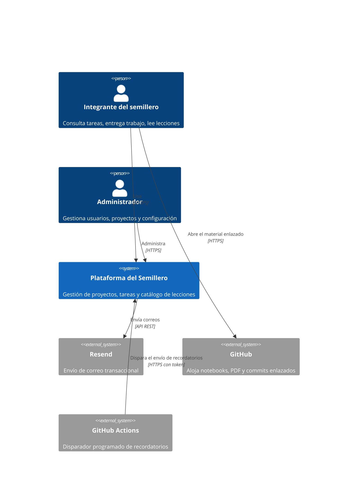
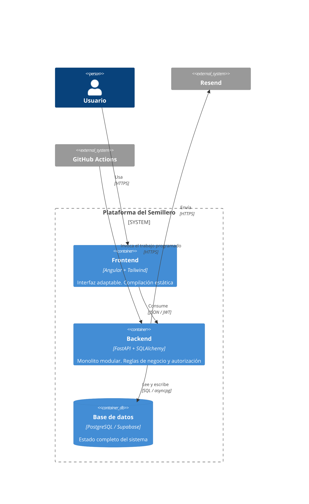

# Arquitectura

---

## 1. Vista general

Monolito modular en el backend, aplicación de página única en el frontend, base de datos gestionada. Tres piezas desplegadas por separado más un proceso programado externo.

```
Navegador (Angular SPA)
    │  HTTPS + JWT
    ▼
FastAPI en Render  ──────►  PostgreSQL en Supabase
    │                          ▲
    │ API de Resend            │ SQL
    ▼                          │
Correo saliente          GitHub Actions (cron)
                          POST /internal/jobs/reminders
```

### C4 nivel 1 — Contexto



### C4 nivel 2 — Contenedores



---

## 2. El monolito modular: qué significa aquí

Un solo proceso desplegable, una sola base de datos, un solo repositorio de backend, pero con fronteras internas que se respetan como si fueran servicios distintos. El objetivo es poder razonar sobre cada módulo por separado, no prepararse para microservicios.

### Estructura de carpetas

```
backend/
├── app/
│   ├── main.py                  # Creación de la aplicación, middlewares, routers
│   ├── core/
│   │   ├── config.py            # Ajustes con pydantic-settings
│   │   ├── database.py          # Motor, sesión, get_db
│   │   ├── security.py          # Hash de contraseñas, emisión y validación de JWT
│   │   ├── dependencies.py      # get_current_user, require_global_role, require_project_permission
│   │   ├── exceptions.py        # Excepciones de dominio y sus manejadores HTTP
│   │   └── pagination.py
│   ├── modules/
│   │   ├── auth/
│   │   │   ├── router.py        # Endpoints. Sin lógica de negocio
│   │   │   ├── service.py       # Reglas de negocio. Sin SQL crudo, sin objetos HTTP
│   │   │   ├── repository.py    # Consultas. Sin reglas de negocio
│   │   │   ├── models.py        # Modelos SQLAlchemy
│   │   │   ├── schemas.py       # Esquemas Pydantic de entrada y salida
│   │   │   └── exceptions.py
│   │   ├── users/
│   │   ├── projects/            # Incluye roles y membresías
│   │   ├── tasks/               # Incluye entregas y comentarios
│   │   ├── lessons/
│   │   └── notifications/
│   ├── jobs/
│   │   └── reminders.py         # Lógica del trabajo programado
│   ├── integrations/
│   │   └── email/
│   │       ├── client.py        # Cliente de Resend
│   │       └── templates/       # Plantillas HTML de correo
│   └── cli.py                   # create_admin y utilidades de mantenimiento
├── alembic/
├── tests/
│   ├── unit/                    # Servicios con dependencias simuladas
│   └── integration/             # Endpoints contra base de datos de pruebas
├── pyproject.toml
└── .env.example
```

### Reglas de frontera entre módulos

Estas reglas son lo que hace que el monolito sea modular en vez de un montón de archivos:

1. **Un router nunca consulta la base de datos.** Llama al servicio y traduce el resultado a HTTP.
2. **Un servicio nunca conoce HTTP.** No recibe `Request` ni devuelve `JSONResponse`. Levanta excepciones de dominio que el manejador global convierte en códigos de estado.
3. **Un repositorio nunca decide.** Recibe parámetros, ejecuta la consulta, devuelve datos. Ninguna condición de negocio vive ahí.
4. **Un módulo no importa el repositorio ni los modelos de otro módulo.** Si `tasks` necesita saber algo de `projects`, llama a `projects.service`. La única excepción son las llaves foráneas por identificador.
5. **No hay relaciones de SQLAlchemy que crucen módulos.** `Task` no declara `relationship("Project")`. Guarda `project_id` y punto. Esto evita que una consulta en un módulo arrastre media base de datos sin que nadie se dé cuenta.
6. **Las transacciones se abren y cierran en el servicio**, nunca en el repositorio ni en el router.

### Dependencias permitidas

```
auth   →  users
tasks  →  projects, notifications
projects → users
lessons → (ninguno)
notifications → (ninguno; recibe datos, no los busca)
```

`notifications` no importa nada de nadie: los otros módulos le pasan la información que debe enviar. Así se puede probar en aislamiento y no se convierte en el nudo donde todo se enreda.

---

## 3. Autenticación y autorización

### Flujo de tokens

- **Token de acceso:** JWT firmado con HS256, vigencia 15 minutos. Contenido: `sub` (id de usuario), `global_role`, `exp`, `iat`, `jti`.
- **Token de refresco:** cadena aleatoria de 32 bytes, vigencia 7 días, guardada hasheada con SHA-256 en la base de datos. Rotativa: cada uso emite una nueva y revoca la anterior.
- **Almacenamiento en el cliente:** ambos en memoria dentro de un servicio de Angular; el de refresco se persiste en `localStorage` para sobrevivir a la recarga. Es una herramienta interna sin datos sensibles; la complejidad de cookies `HttpOnly` con CSRF no se justifica. Queda anotado como una decisión consciente y no como un descuido.

### Por qué los permisos no van dentro del token

El JWT lleva **solo** el rol global. Los permisos de proyecto se consultan en cada petición, porque un líder puede cambiar los permisos de un rol en cualquier momento y ese cambio debe surtir efecto de inmediato (RN-22). Meterlos en el token obligaría a esperar 15 minutos o a implementar una lista de revocación, lo cual es más complejo que una consulta indexada.

### Dependencia de autorización

```python
def require_project_permission(permission: str):
    async def dependency(
        project_id: UUID,
        user: User = Depends(get_current_user),
        db: AsyncSession = Depends(get_db),
    ) -> ProjectContext:
        ctx = await projects_service.get_context(db, project_id, user.id)
        if ctx is None:
            raise NotFoundError("Proyecto no encontrado")   # 404, no 403: no se filtra la existencia
        if permission not in ctx.permissions:
            raise ForbiddenError(f"Se requiere el permiso {permission}")
        if ctx.project.status == ProjectStatus.ARCHIVED and permission != "project.archive":
            raise ConflictError("El proyecto está archivado")
        return ctx
    return dependency
```

Tres detalles que importan:

- **404 en lugar de 403** cuando el usuario no es miembro. Un 403 confirmaría que el proyecto existe.
- **La verificación de archivado está centralizada aquí**, no repartida por cada endpoint. Cumple RN-15 sin depender de que nadie se acuerde.
- `ProjectContext` trae el proyecto, la membresía y el conjunto de permisos ya resueltos, para que el servicio no vuelva a consultarlos.

---

## 4. El proceso programado de recordatorios

La restricción de fondo: **Render no ofrece trabajos programados en el plan gratuito**. La solución es un disparador externo.

### Componentes

**1. Endpoint interno**

```
POST /internal/jobs/reminders
Header: X-Job-Token: <secreto compartido>
```

No usa JWT. Se autentica con un secreto comparado en tiempo constante. Está fuera del esquema de OpenAPI público.

**2. Flujo de trabajo de GitHub Actions**

```yaml
name: Recordatorios
on:
  schedule:
    - cron: '0 12 * * *'   # 12:00 UTC = 07:00 America/Bogota
  workflow_dispatch:
jobs:
  send:
    runs-on: ubuntu-latest
    steps:
      - name: Despertar la API
        run: curl -s -o /dev/null --max-time 120 --retry 3 ${{ secrets.API_URL }}/health
      - name: Ejecutar recordatorios
        run: |
          curl -sS -X POST ${{ secrets.API_URL }}/internal/jobs/reminders \
            -H "X-Job-Token: ${{ secrets.JOB_TOKEN }}" \
            --max-time 300 --fail
```

El primer paso existe porque el servicio puede estar suspendido: si el disparo llegara directo, la primera petición se agotaría antes de que arrancara el proceso.

**Advertencia sobre el cron de GitHub Actions:** las ejecuciones programadas suelen retrasarse, a veces varios minutos, y en momentos de mucha carga pueden saltarse. Para recordatorios diarios es tolerable. Es la razón por la que RN-29 existe.

**3. Segundo flujo para mantener despierto el servicio**

Cada 10 minutos entre las 6:00 y las 23:00 hora de Colombia, un `curl` a `/health`, que a su vez ejecuta un `SELECT 1` contra la base de datos. Mata dos pájaros: evita la suspensión de Render (RNF-02) y la pausa por inactividad de Supabase (RNF-07).

### Algoritmo

```
config ← notification_settings
hoy ← fecha actual en America/Bogota

para cada d en config.reminder_days_before:
    tareas ← SELECT de tasks
              WHERE due_date = hoy + d
                AND status <> 'DONE'
                AND deleted_at IS NULL
                AND project.status = 'ACTIVE'
    para cada tarea, para cada responsable activo:
        despachar(usuario, tarea, 'TASK_DUE_SOON', hoy)

si config.overdue_enabled:
    tareas ← ... WHERE due_date < hoy AND (mismas condiciones)
    destinatarios ← responsables activos ∪ miembros con task.review
    para cada destinatario:
        despachar(destinatario, tarea, 'TASK_OVERDUE', hoy)

función despachar(usuario, tarea, tipo, fecha):
    INSERT INTO notification_dispatches (...) ON CONFLICT DO NOTHING RETURNING id
    si no devolvió fila: return            # ya se envió hoy, se omite
    crear notification dentro de la aplicación
    enviar correo; actualizar status y provider_message_id
```

La inserción **antes** del envío, con `ON CONFLICT DO NOTHING`, es lo que hace el trabajo idempotente (RN-27). Si el proceso se ejecuta dos veces, la segunda no inserta y no envía. Delegar esto a la restricción de unicidad de PostgreSQL es más confiable que cualquier comprobación previa en Python, que siempre tiene una ventana de carrera.

---

## 5. Frontend

### Estructura

```
frontend/src/app/
├── core/
│   ├── auth/            # Servicio de autenticación, guardas, interceptor
│   ├── api/             # Cliente HTTP con tipos generados
│   └── layout/          # Estructura general, barra lateral, campana
├── features/
│   ├── auth/            # Ingreso, aceptar invitación, recuperar contraseña
│   ├── dashboard/       # Mis tareas entre todos los proyectos
│   ├── projects/        # Lista, detalle, tablero, miembros, roles
│   ├── lessons/         # Catálogo y edición
│   └── admin/           # Usuarios, invitaciones, configuración
└── shared/
    ├── ui/              # Componentes reutilizables
    └── pipes/
```

### Decisiones

- **Componentes standalone y signals.** Sin NgModules. `signal`, `computed` y `resource` para el estado; nada de NgRx, que sería desproporcionado para esta escala.
- **Rutas con carga diferida** por funcionalidad, para que el paquete inicial sea pequeño.
- **Interceptor HTTP** que adjunta el token de acceso, renueva de forma transparente ante un 401, y encola las peticiones concurrentes durante la renovación para no disparar varios refrescos a la vez.
- **Interceptor de arranque en frío**: si una petición pasa de 3 segundos, se emite un evento que muestra el aviso de "despertando el servidor" a nivel global.
- **Tailwind** para los estilos, con los tokens de diseño que defina Impeccable.
- **Impeccable** manda en todo lo visual. Ver `CLAUDE.md`.

### Estrategia adaptable (RNF-01)

| Ancho | Tablero | Navegación |
|---|---|---|
| < 768 px | Lista agrupada por estado, con selector desplegable para cambiar de estado | Barra inferior |
| 768–1024 px | Columnas con desplazamiento horizontal, arrastrar y soltar activo | Barra lateral colapsable |
| > 1024 px | Cinco columnas visibles, arrastrar y soltar | Barra lateral fija |

El arrastrar y soltar se desactiva por debajo de 768 px: en móvil es incómodo y propenso a errores. El selector de estado es más rápido y más accesible.

---

## 6. Despliegue

| Componente | Servicio | Dominio |
|---|---|---|
| Frontend | Cloudflare Pages | `app.kairospartners.uk` |
| Backend | Render (plan gratuito) | `api.kairospartners.uk` |
| Base de datos | Supabase (plan gratuito) | interno |
| Correo | Resend | remitente en `send.kairospartners.uk` |
| Programación | GitHub Actions | — |

### Registros DNS necesarios

| Nombre | Tipo | Propósito |
|---|---|---|
| `app` | CNAME | Cloudflare Pages |
| `api` | CNAME | Render |
| `send` | los que indique Resend | SPF y DKIM |
| `_dmarc` | TXT | `v=DMARC1; p=none; rua=mailto:...` — no lo crea Resend, hay que ponerlo a mano |

### Variables de entorno del backend

```
DATABASE_URL=postgresql+asyncpg://...
JWT_SECRET=...
JWT_ACCESS_TTL_MINUTES=15
JWT_REFRESH_TTL_DAYS=7
RESEND_API_KEY=...
EMAIL_FROM=Semillero ML <notificaciones@send.kairospartners.uk>
FRONTEND_URL=https://app.kairospartners.uk
JOB_TOKEN=...
CORS_ORIGINS=https://app.kairospartners.uk
ENVIRONMENT=production
```

### Migraciones

Alembic, ejecutado en el arranque del despliegue de Render mediante `alembic upgrade head` en el comando de inicio. Con un equipo de cuatro personas y despliegues poco frecuentes, es aceptable; deja de serlo si en algún momento hay varias instancias.

**Conexión a Supabase:** usar el conector agrupado en el puerto 6543 (modo de transacción), no la conexión directa. El plan gratuito limita las conexiones directas y el agrupador evita agotarlas. Con `asyncpg` en modo de transacción hay que desactivar la caché de sentencias preparadas: `poolclass=NullPool` y `connect_args={"statement_cache_size": 0}`.

---

## 7. Manejo de errores

Formato uniforme para toda respuesta de error:

```json
{
  "error": {
    "code": "PROJECT_ARCHIVED",
    "message": "El proyecto está archivado y no admite modificaciones",
    "details": null
  }
}
```

| Excepción de dominio | HTTP | Código |
|---|---|---|
| `NotFoundError` | 404 | `NOT_FOUND` |
| `ForbiddenError` | 403 | `FORBIDDEN` |
| `ConflictError` | 409 | `CONFLICT` |
| `ValidationError` | 422 | `VALIDATION_ERROR` |
| `AuthenticationError` | 401 | `UNAUTHENTICATED` |

Los mensajes van en español, porque se muestran directamente al usuario. Los códigos van en inglés, porque los consume el frontend.

---

## 8. Pruebas

| Nivel | Alcance | Herramienta |
|---|---|---|
| Unitarias | Servicios con repositorios simulados. Prioridad: máquina de estados de tareas, resolución de permisos, algoritmo del programador | pytest |
| Integración | Endpoints contra PostgreSQL real en contenedor | pytest + httpx |
| Frontend | Servicios y guardas | Vitest |

**Cobertura mínima obligatoria** en: transiciones de estado de tareas, `require_project_permission` y la idempotencia del trabajo programado. Son los tres puntos donde un error pasa desapercibido y hace daño real.

---

## 9. Decisiones registradas

| Decisión | Alternativa descartada | Motivo |
|---|---|---|
| Autenticación propia con JWT | Supabase Auth | Control total; el equipo quiere aprender el mecanismo; evita atar el modelo de usuarios a un proveedor |
| Supabase solo como PostgreSQL | Supabase con RLS y cliente directo | Con toda la autorización en FastAPI, RLS duplicaría las reglas en dos lugares y sería fuente de contradicciones |
| Permisos consultados por petición | Permisos dentro del JWT | Los cambios de rol deben surtir efecto de inmediato (RN-22) |
| GitHub Actions como programador | Render Cron, APScheduler dentro del proceso | Render Cron es de pago; APScheduler no funciona en un servicio que se suspende |
| Periodicidad como etiqueta | Recurrencia real con generación automática | El equipo la pidió así; la recurrencia trae plantillas, instancias y sincronización, y no resuelve un problema actual |
| Un rol por usuario por proyecto | Varios roles acumulables | La suma de permisos de varios roles vuelve imposible saber por qué alguien puede algo |
| Sin bitácora de auditoría | Bitácora completa | Descartada explícitamente; `created_by` y `updated_at` bastan |
| Angular con signals, sin NgRx | NgRx | Desproporcionado para esta escala |
