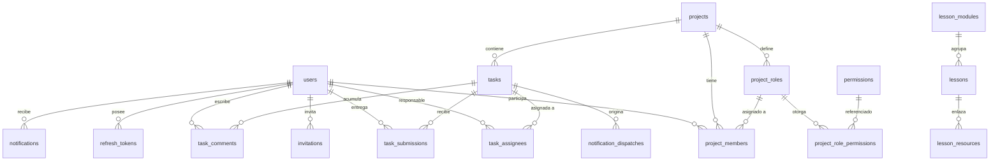

# Modelo de datos

PostgreSQL 15+ en Supabase. Tercera forma normal. Claves primarias `uuid` con `gen_random_uuid()`. Todas las marcas de tiempo son `timestamptz` en UTC.

---

## 1. Convenciones

- Tablas en plural y `snake_case`, en inglés.
- Toda tabla de negocio lleva `created_at timestamptz NOT NULL DEFAULT now()`.
- Las tablas mutables llevan además `updated_at`, mantenido por un trigger `set_updated_at()`.
- El borrado lógico usa `deleted_at timestamptz NULL`. Solo lo tienen `tasks` y `task_comments`.
- Los enumerados se implementan como tipos `ENUM` de PostgreSQL cuando el conjunto es cerrado y estable, y como tabla catálogo cuando debe consultarse o referenciarse (caso de `permissions`).
- Las llaves foráneas usan `ON DELETE RESTRICT` por defecto. `CASCADE` solo donde el hijo carece de sentido sin el padre, y está señalado explícitamente.

---

## 2. Tipos enumerados

```sql
CREATE TYPE global_role AS ENUM ('ADMIN', 'LESSON_EDITOR', 'MEMBER');
CREATE TYPE user_status AS ENUM ('ACTIVE', 'DISABLED');
CREATE TYPE invitation_status AS ENUM ('PENDING', 'ACCEPTED', 'REVOKED', 'EXPIRED');
CREATE TYPE project_status AS ENUM ('ACTIVE', 'ARCHIVED');
CREATE TYPE task_status AS ENUM ('BACKLOG', 'TODO', 'IN_PROGRESS', 'IN_REVIEW', 'DONE');
CREATE TYPE task_periodicity AS ENUM ('ONE_TIME', 'WEEKLY', 'MONTHLY', 'SEMESTER');
CREATE TYPE submission_review_status AS ENUM ('PENDING', 'APPROVED', 'REJECTED');
CREATE TYPE resource_type AS ENUM ('NOTEBOOK', 'PDF', 'VIDEO', 'REPOSITORY', 'ARTICLE');
CREATE TYPE notification_kind AS ENUM (
  'TASK_ASSIGNED', 'TASK_DUE_SOON', 'TASK_OVERDUE',
  'SUBMISSION_APPROVED', 'SUBMISSION_REJECTED'
);
CREATE TYPE dispatch_status AS ENUM ('SENT', 'FAILED');
```

---

## 3. Módulo: identidad y acceso

### `users`

| Columna | Tipo | Restricciones |
|---|---|---|
| `id` | uuid | PK |
| `full_name` | text | NOT NULL, longitud 2–120 |
| `email` | citext | NOT NULL, UNIQUE |
| `password_hash` | text | NOT NULL |
| `global_role` | global_role | NOT NULL, DEFAULT `'MEMBER'` |
| `status` | user_status | NOT NULL, DEFAULT `'ACTIVE'` |
| `last_login_at` | timestamptz | NULL |
| `created_at` / `updated_at` | timestamptz | NOT NULL |

Se usa la extensión `citext` para que el correo sea único sin distinguir mayúsculas. Alternativa si no está disponible: índice único sobre `lower(email)`.

Índices: `UNIQUE (email)`, `INDEX (status) WHERE status = 'ACTIVE'`.

### `invitations`

| Columna | Tipo | Restricciones |
|---|---|---|
| `id` | uuid | PK |
| `email` | citext | NOT NULL |
| `global_role` | global_role | NOT NULL |
| `token_hash` | text | NOT NULL, UNIQUE |
| `expires_at` | timestamptz | NOT NULL |
| `status` | invitation_status | NOT NULL, DEFAULT `'PENDING'` |
| `invited_by` | uuid | FK → `users(id)`, NOT NULL |
| `accepted_at` | timestamptz | NULL |
| `accepted_user_id` | uuid | FK → `users(id)`, NULL |
| `created_at` | timestamptz | NOT NULL |

Restricción: `UNIQUE (email) WHERE status = 'PENDING'` (índice único parcial). Garantiza una sola invitación viva por correo.

**Decisión de diseño.** El usuario **no** se crea al invitar, sino al aceptar. Evita filas de usuarios a medias, sin nombre ni contraseña, contaminando los selectores de asignación.

### `refresh_tokens`

| Columna | Tipo | Restricciones |
|---|---|---|
| `id` | uuid | PK |
| `user_id` | uuid | FK → `users(id)` ON DELETE CASCADE, NOT NULL |
| `token_hash` | text | NOT NULL, UNIQUE |
| `expires_at` | timestamptz | NOT NULL |
| `revoked_at` | timestamptz | NULL |
| `user_agent` | text | NULL |
| `created_at` | timestamptz | NOT NULL |

Índice: `(user_id) WHERE revoked_at IS NULL`.

### `password_reset_tokens`

Misma forma que `refresh_tokens`, con `used_at` en lugar de `revoked_at` y vigencia de 1 hora.

---

## 4. Módulo: proyectos y roles

### `projects`

| Columna | Tipo | Restricciones |
|---|---|---|
| `id` | uuid | PK |
| `name` | text | NOT NULL, longitud 3–120 |
| `description` | text | NULL |
| `status` | project_status | NOT NULL, DEFAULT `'ACTIVE'` |
| `start_date` | date | NULL |
| `created_by` | uuid | FK → `users(id)`, NOT NULL |
| `archived_at` | timestamptz | NULL |
| `created_at` / `updated_at` | timestamptz | NOT NULL |

Restricción: `CHECK ((status = 'ARCHIVED') = (archived_at IS NOT NULL))`. Impide que el estado y la fecha se desincronicen.

Índice: `(status)`.

### `permissions`

Tabla catálogo, poblada por migración. No se modifica en tiempo de ejecución.

| Columna | Tipo | Restricciones |
|---|---|---|
| `code` | text | PK (por ejemplo `task.review`) |
| `description` | text | NOT NULL |
| `category` | text | NOT NULL (`task`, `member`, `role`, `project`) |

Los 14 códigos están en `business-rules.md`, sección 3.

### `project_roles`

| Columna | Tipo | Restricciones |
|---|---|---|
| `id` | uuid | PK |
| `project_id` | uuid | FK → `projects(id)` ON DELETE CASCADE, NOT NULL |
| `name` | text | NOT NULL, longitud 2–40 |
| `color` | text | NOT NULL, `CHECK (color ~ '^#[0-9A-Fa-f]{6}$')` |
| `is_system` | boolean | NOT NULL, DEFAULT false |
| `created_by` | uuid | FK → `users(id)`, NULL (nulo en los roles del sistema) |
| `created_at` / `updated_at` | timestamptz | NOT NULL |

Restricción: `UNIQUE (project_id, lower(name))`.

### `project_role_permissions`

Tabla puente. Resuelve la relación muchos a muchos entre roles y permisos, que es lo que hace configurable el sistema.

| Columna | Tipo | Restricciones |
|---|---|---|
| `project_role_id` | uuid | FK → `project_roles(id)` ON DELETE CASCADE |
| `permission_code` | text | FK → `permissions(code)` |

PK compuesta `(project_role_id, permission_code)`.

### `project_members`

| Columna | Tipo | Restricciones |
|---|---|---|
| `id` | uuid | PK |
| `project_id` | uuid | FK → `projects(id)` ON DELETE CASCADE, NOT NULL |
| `user_id` | uuid | FK → `users(id)`, NOT NULL |
| `project_role_id` | uuid | FK → `project_roles(id)`, NOT NULL |
| `added_by` | uuid | FK → `users(id)`, NOT NULL |
| `joined_at` | timestamptz | NOT NULL |

Restricción: `UNIQUE (project_id, user_id)`. **Un usuario tiene un único rol por proyecto.**

Índices: `(user_id)` para la vista "Mis proyectos", `(project_id)`.

Restricción de integridad que la base no puede expresar sola y va en la capa de servicio: `project_role_id` debe pertenecer al mismo `project_id`. Se valida en el servicio y se refuerza opcionalmente con una FK compuesta añadiendo `UNIQUE (id, project_id)` en `project_roles`.

---

## 5. Módulo: tareas

### `tasks`

| Columna | Tipo | Restricciones |
|---|---|---|
| `id` | uuid | PK |
| `project_id` | uuid | FK → `projects(id)`, NOT NULL |
| `title` | text | NOT NULL, longitud 3–200 |
| `description` | text | NULL |
| `status` | task_status | NOT NULL, DEFAULT `'BACKLOG'` |
| `periodicity` | task_periodicity | NOT NULL, DEFAULT `'ONE_TIME'` |
| `due_date` | date | NULL |
| `created_by` | uuid | FK → `users(id)`, NOT NULL |
| `completed_at` | timestamptz | NULL |
| `deleted_at` | timestamptz | NULL |
| `created_at` / `updated_at` | timestamptz | NOT NULL |

Restricción: `CHECK ((status = 'DONE') = (completed_at IS NOT NULL))`.

Índices:
- `(project_id, status) WHERE deleted_at IS NULL` — es la consulta del tablero
- `(due_date) WHERE deleted_at IS NULL AND status <> 'DONE'` — es la consulta del scheduler

`due_date` es `date`, no `timestamptz`: el vencimiento es un día calendario en hora de Colombia, no un instante. Esto evita el clásico error de que una tarea "vence" a las 7 p.m. del día anterior por conversión de zona horaria.

### `task_assignees`

| Columna | Tipo | Restricciones |
|---|---|---|
| `task_id` | uuid | FK → `tasks(id)` ON DELETE CASCADE |
| `user_id` | uuid | FK → `users(id)` |
| `assigned_by` | uuid | FK → `users(id)`, NOT NULL |
| `assigned_at` | timestamptz | NOT NULL |

PK compuesta `(task_id, user_id)`. Índice adicional en `(user_id)` para la vista "Mis tareas".

### `task_submissions`

| Columna | Tipo | Restricciones |
|---|---|---|
| `id` | uuid | PK |
| `task_id` | uuid | FK → `tasks(id)` ON DELETE CASCADE, NOT NULL |
| `submitted_by` | uuid | FK → `users(id)`, NOT NULL |
| `description` | text | NOT NULL, longitud 10–4000 |
| `commit_url` | text | NULL, `CHECK (commit_url IS NULL OR commit_url ~ '^https://github\.com/')` |
| `review_status` | submission_review_status | NOT NULL, DEFAULT `'PENDING'` |
| `reviewed_by` | uuid | FK → `users(id)`, NULL |
| `reviewed_at` | timestamptz | NULL |
| `review_comment` | text | NULL |
| `created_at` | timestamptz | NOT NULL |

Restricciones:
- `CHECK ((review_status = 'PENDING') = (reviewed_at IS NULL))`
- `CHECK (review_status <> 'REJECTED' OR review_comment IS NOT NULL)` — devolver exige explicación

Índice: `UNIQUE (task_id) WHERE review_status = 'PENDING'`. Impide dos entregas pendientes simultáneas sobre la misma tarea.

### `task_comments`

| Columna | Tipo | Restricciones |
|---|---|---|
| `id` | uuid | PK |
| `task_id` | uuid | FK → `tasks(id)` ON DELETE CASCADE, NOT NULL |
| `author_id` | uuid | FK → `users(id)`, NOT NULL |
| `body` | text | NOT NULL, longitud 1–4000 |
| `deleted_at` | timestamptz | NULL |
| `created_at` / `updated_at` | timestamptz | NOT NULL |

Índice: `(task_id, created_at) WHERE deleted_at IS NULL`.

---

## 6. Módulo: notificaciones

### `notification_settings`

Fila única para toda la plataforma.

| Columna | Tipo | Restricciones |
|---|---|---|
| `id` | smallint | PK, `CHECK (id = 1)` |
| `reminder_days_before` | int[] | NOT NULL, DEFAULT `'{3,1,0}'` |
| `send_hour` | smallint | NOT NULL, DEFAULT 7, `CHECK (0 ≤ send_hour ≤ 23)` |
| `timezone` | text | NOT NULL, DEFAULT `'America/Bogota'` |
| `overdue_enabled` | boolean | NOT NULL, DEFAULT true |
| `updated_by` | uuid | FK → `users(id)`, NULL |
| `updated_at` | timestamptz | NOT NULL |

El truco de `CHECK (id = 1)` fuerza que exista una sola configuración global, tal como pide RF-43.

### `notifications`

Registro dentro de la aplicación.

| Columna | Tipo | Restricciones |
|---|---|---|
| `id` | uuid | PK |
| `user_id` | uuid | FK → `users(id)` ON DELETE CASCADE, NOT NULL |
| `kind` | notification_kind | NOT NULL |
| `title` | text | NOT NULL |
| `body` | text | NOT NULL |
| `task_id` | uuid | FK → `tasks(id)` ON DELETE CASCADE, NULL |
| `project_id` | uuid | FK → `projects(id)` ON DELETE CASCADE, NULL |
| `read_at` | timestamptz | NULL |
| `created_at` | timestamptz | NOT NULL |

Índice: `(user_id, created_at DESC)` y `(user_id) WHERE read_at IS NULL` para el contador de no leídas.

### `notification_dispatches`

Bitácora de envíos de correo. Es la pieza que garantiza la idempotencia (RN-27).

| Columna | Tipo | Restricciones |
|---|---|---|
| `id` | uuid | PK |
| `user_id` | uuid | FK → `users(id)`, NOT NULL |
| `task_id` | uuid | FK → `tasks(id)`, NULL |
| `kind` | notification_kind | NOT NULL |
| `target_date` | date | NOT NULL |
| `status` | dispatch_status | NOT NULL |
| `provider_message_id` | text | NULL |
| `error_message` | text | NULL |
| `attempts` | smallint | NOT NULL, DEFAULT 1 |
| `created_at` | timestamptz | NOT NULL |

**Restricción crítica:** `UNIQUE (user_id, task_id, kind, target_date)`. El scheduler intenta insertar aquí **antes** de enviar; si la inserción viola la restricción, ya se envió y se omite. Es idempotencia garantizada por la base de datos, no por lógica de aplicación, que es lo que la hace confiable ante ejecuciones concurrentes o reintentos.

---

## 7. Módulo: lecciones

### `lesson_modules`

| Columna | Tipo | Restricciones |
|---|---|---|
| `id` | uuid | PK |
| `title` | text | NOT NULL, longitud 3–150 |
| `description` | text | NULL |
| `position` | int | NOT NULL |
| `is_published` | boolean | NOT NULL, DEFAULT false |
| `created_by` | uuid | FK → `users(id)`, NOT NULL |
| `created_at` / `updated_at` | timestamptz | NOT NULL |

### `lessons`

| Columna | Tipo | Restricciones |
|---|---|---|
| `id` | uuid | PK |
| `module_id` | uuid | FK → `lesson_modules(id)` ON DELETE CASCADE, NOT NULL |
| `title` | text | NOT NULL |
| `description` | text | NULL |
| `position` | int | NOT NULL |
| `is_published` | boolean | NOT NULL, DEFAULT false |
| `created_by` | uuid | FK → `users(id)`, NOT NULL |
| `created_at` / `updated_at` | timestamptz | NOT NULL |

Índice: `(module_id, position)`.

### `lesson_resources`

| Columna | Tipo | Restricciones |
|---|---|---|
| `id` | uuid | PK |
| `lesson_id` | uuid | FK → `lessons(id)` ON DELETE CASCADE, NOT NULL |
| `type` | resource_type | NOT NULL |
| `title` | text | NOT NULL |
| `url` | text | NOT NULL, `CHECK (url ~ '^https?://')` |
| `position` | int | NOT NULL |
| `created_at` | timestamptz | NOT NULL |

---

## 8. Notas de normalización

- **1FN:** ninguna columna guarda listas, con una excepción deliberada: `notification_settings.reminder_days_before` es un `int[]`. Se justifica porque es una fila única de configuración, el arreglo nunca se consulta ni se une con otras tablas, y una tabla aparte para tres enteros sería ceremonia sin beneficio. Queda documentado como excepción consciente.
- **2FN:** todas las tablas puente (`task_assignees`, `project_role_permissions`) contienen únicamente atributos que dependen de la clave compuesta completa (`assigned_by`, `assigned_at` dependen del par tarea-usuario, no de uno solo).
- **3FN:** no se guardan datos derivados. En particular **no** existen columnas como `tasks.assignee_count`, `projects.member_count` ni `tasks.is_overdue`. Lo vencido se calcula comparando `due_date` con la fecha actual en `America/Bogota`. El conteo de miembros se calcula al consultar.
- **Redundancia controlada:** ninguna, en esta versión. Con 50 usuarios y 1.000 tareas, ninguna consulta justifica desnormalizar.

---

## 9. Diagrama entidad-relación



---

## 10. Datos iniciales de la migración

1. Los 14 registros de `permissions`.
2. La fila única de `notification_settings` con los valores por defecto.
3. El primer usuario `ADMIN`, creado por un comando de línea de órdenes (`python -m app.cli create_admin`), nunca por un endpoint expuesto.

Los roles de proyecto predeterminados **no** son datos iniciales globales: se generan por proyecto, dentro de la misma transacción que crea el proyecto.
